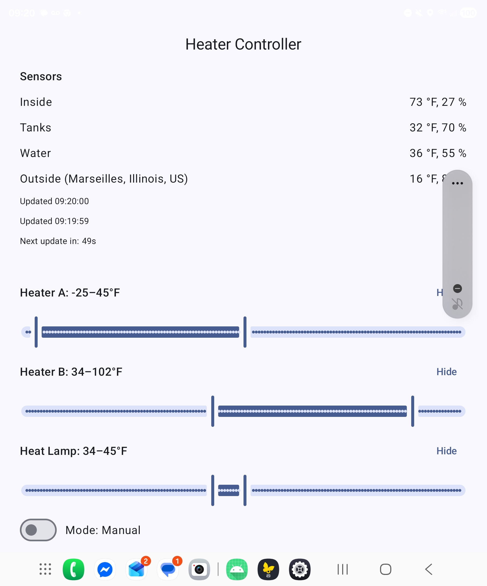
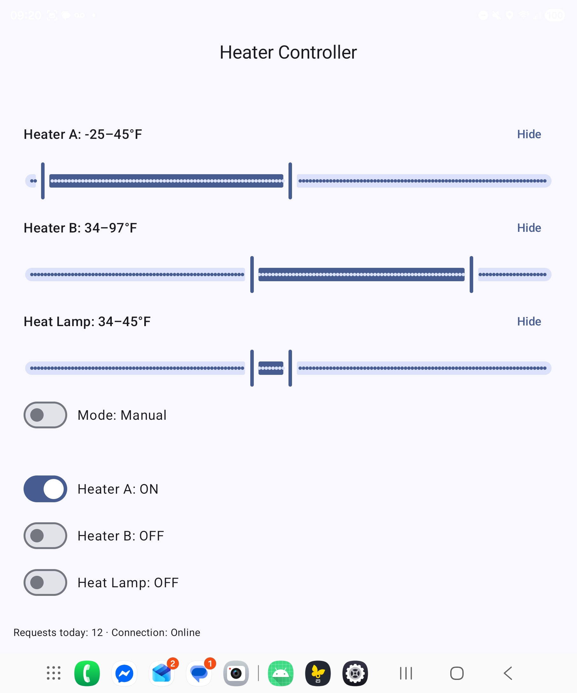

# HeaterController

HeaterController is an Android app (Jetpack Compose + Kotlin) that reads temperature and humidity data from Govee sensors and controls Govee devices (heaters and a heat lamp) via the Govee Developer API.

It was built to solve a real-world problem: protecting RV plumbing and tanks from freezing in cold weather, where existing smart-home apps did not provide sufficient control, visibility, or flexibility.

---

## Screenshots

### Main Sensor Overview


### Heater Control & Thresholds


> The app displays live sensor readings (inside, tanks, water, outside), update timing, configurable temperature ranges for each heater, manual override switches, and current device states.

---

## How It Works

1. The app periodically polls Govee temperature/humidity sensors using the Govee Developer API  
2. Sensor readings are compared against user-defined temperature ranges  
3. Heaters and a heat lamp are toggled via Govee smart plugs when thresholds are crossed  
4. The UI displays current readings, heater states, refresh timing, and connection status  

This provides simple, reliable freeze protection without fixed schedules or external automation platforms.

---

## Setup (Secrets Not Committed)

This repository intentionally does **not** include any API keys or keystore files.  
Configuration is provided locally using one of the following methods.

### `local.properties` (recommended, not tracked)

```properties
# Govee API
API_KEY=your_govee_api_key
API_KEY_DEBUG=your_debug_key_optional
API_KEY_RELEASE=your_release_key_optional

# Sensor devices
GOVEE_INSIDE_DEVICE=...
GOVEE_INSIDE_MODEL=H5100
GOVEE_TANKS_DEVICE=...
GOVEE_TANKS_MODEL=H5100
GOVEE_WATER_DEVICE=...
GOVEE_WATER_MODEL=H5100

# Outputs (heaters / lamp)
GOVEE_HEATER_A_DEVICE=...
GOVEE_HEATER_A_MODEL=H5080
GOVEE_HEATER_B_DEVICE=...
GOVEE_HEATER_B_MODEL=H5080
GOVEE_LAMP_DEVICE=...
GOVEE_LAMP_MODEL=H5080

# Weather (optional)
WEATHER_API_KEY=...
WEATHER_LOCATION=City,ST,Country

